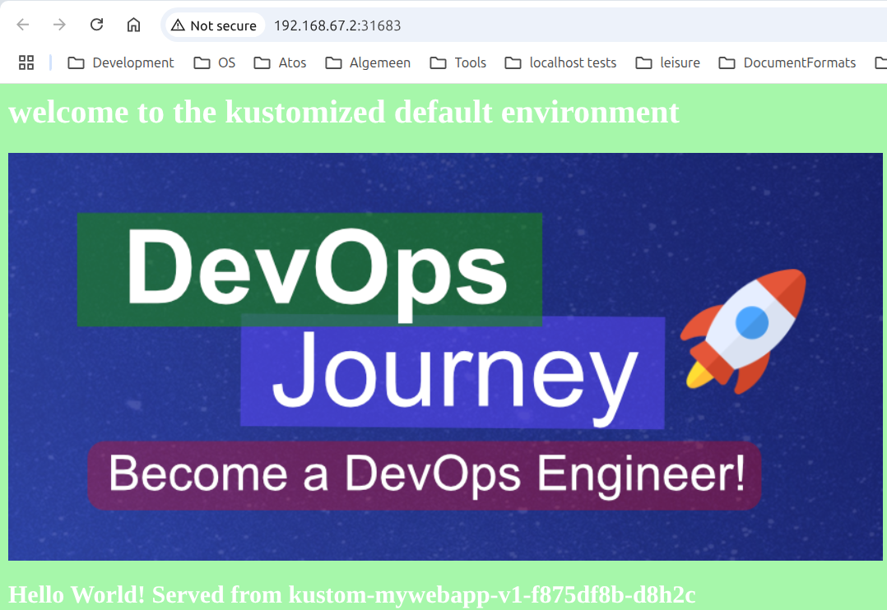

<style>
body {
  font-family: "Gentium Basic", Cardo , "Linux Libertine o", "Palatino Linotype", Cambria, serif;
  font-size: 100% !important;
  padding-right: 12%;
}
code {
  padding: 0.25em;
	
  white-space: pre;
  font-family: "Tlwg mono", Consolas, "Liberation Mono", Menlo, Courier, monospace;
	
  background-color: #ECFFFA;
  //border: 1px solid #ccc;
  //border-radius: 3px;
}

kbd {
  display: inline-block;
  padding: 3px 5px;
  font-family: "Tlwg mono", Consolas, "Liberation Mono", Menlo, Courier, monospace;
  line-height: 10px;
  color: #555;
  vertical-align: middle;
  background-color: #ECFFFA;
  border: solid 1px #ccc;
  border-bottom-color: #bbb;
  border-radius: 3px;
  box-shadow: inset 0 -1px 0 #bbb;
}

h1,h2,h3,h4,h5 {
  color: #269B7D; 
  font-family: "fira sans", "Latin Modern Sans", Calibri, "Trebuchet MS", sans-serif;
}

</style>

# Kustomize $1^{rst}$ steps
- [https://youtu.be/spCdNeNCuFU?t=260&si=rGhLy66hUawE3KqZ](https://youtu.be/spCdNeNCuFU?t=260&si=rGhLy66hUawE3KqZ)

## Objectives
- start using kustomize to
   - create consistency in labels & naming and reduce complexity of k8s manifest files
   - generate a config map from a simple properties file

## Steps
1. we create a [`work/`](../work) directory into which we copy the content of [`original/`](../original)
2. we add [`work/kustomization.yaml`](../work/kustomization.yaml) and add
   1. `resources`
   2. `commonLabels`
   3. `commonAnnotations`
   4. `namePrefix`
   5. `nameSuffix`
   6. `configMapGenerator`

### resources
- we take over all resources we want to use as input for the final manifest:
  ```yaml
  resources:
     - deployment.yaml
     - service.yaml
  ```
  - this excludes the old `configmap.yaml` as we will generate this manifest from 
    [`work/config.properties`](work/config.properties)

### commonLabels
```yaml
commonLabels:
  app: mywebapp
```
- This replaces all occurrences of the `app: mywebapp` label in all manifests listed as resource.
- Therefore, we can now delete all occurrences of `app` in
  - `metadata.labels.app` we can remove the `labels.app` part,
  - `spec.selector.matchLabels.app` we can remove the `selector.matchLabels.app` part, as the selector has no other 
    items,
  - `spec.template.metadata.labels.app` we can remove the `labels.app` part
- When you do a dry run to generate a manifest from `kustomization.yaml` + the manifests listed as resources we get:
  `# Warning: 'commonLabels' is deprecated. Please use 'labels' instead. Run 'kustomize edit fix' to update your Kustomization automatically.`
  so we could update `commonLabels` to `labels`

### commonAnnotations
Adding

```yaml
commonAnnotations:
  app: mykustom-annotations
```

to [`work/kustomization.yaml`](../work/kustomization.yaml) leads to adding `annotations.app` items with value 
`mykustom-annotations` under all `metadata` items in the generated manifest [`work/gen.yaml`](../work/gen.yaml).


### namePrefix
- prefixes all the occurrences of `name` with its value
- e.g.
  ```yaml
  namePrefix:
    kustom-
  ```
- except for 
  - `spec.template.spec.containers[0].name`
  - `spec.ports[0].name`

### nameSuffix
- suffixes all the occurrences of `name` with its value
- e.g.
   ```yaml
   nameSuffix:
    -v1
   ```
- except for
    - `spec.template.spec.containers[0].name`
    - `spec.ports[0].name`

### configMapGenerator:
- generates a configMap entry in the final manifest
- e.g.
  ```yaml
  configMapGenerator:
    - name: mykustom-map
      env: config.properties
  ```
> #### Do NOT forget 
> - replace the value of `spec.template.spec.containers[0].envFrom[0].configMapRef.name` in 
>   [`work/deployment.yaml`](../work/deployment.yaml) from `mywebapp-configmapv1.0` to `mykustom-map`
> - Now in [work/gen.yaml](../work/gen.yaml), the `metadata.name` of the configMap manifest part matches 
>   `spec.template.spec.containers[0].envFrom[0].configMapRef.name` of the deployment manifest part.
>   - In our case `kustom-mykustom-map-v1-k98kg64km2`, so `mykustom-map` is prefixed and suffixed according to our specs
>     in [`work/kustomization.yaml`](../work/kustomization.yaml) and a custom suffix `-k98kg64km2` is added.
> - The main thing is that the corresponding parts match and the deployment manifest will be able to find the configMap.

- check out the changes in the generated manifests: `~/git/mykustomapp$ kubectl kustomize work/ > work/gen.yaml`

<details>

- this all results in [`work/gen.yaml`](../work/gen.yaml) having these relevant fragments:

  ```yaml
  apiVersion: v1
  data:
    BG_COLOR: '#a6f7aa'
    CUSTOM_HEADER: welcome to the default environment
    FONT_COLOR: '#FFFFFF'
  kind: ConfigMap
  metadata:
    annotations:
      app: mykustom-annotations
    labels:
      app: mywebapp
    name: kustom-mykustom-map-v1-k98kg64km2
  ---
  ```
  ```yaml
  apiVersion: apps/v1
  kind: Deployment
  ...
  spec:
    template:
    ...
      spec:
        containers:
        - envFrom:
          - configMapRef:
              name: kustom-mykustom-map-v1-k98kg64km2
  ...
  
  ```

</details>


## Test
- viewing generated manifest `~/git/mykustomapp$ kubectl kustomize work/ > work/gen.yaml`
- directly applying kustomize `~/git/mykustomapp$ kubectl apply -k work/`
- to view the web application in the browser 
  - `kubectl get services` to get the name of the service `kustom-mywebapp-v1`
  - `minikube -p kustomize service kustom-mywebapp-v1` to open the homepage in a browser

<details>

```bash
(base) willem@mint-22:~/git/mykustomapp$ kubectl get services
NAME                 TYPE           CLUSTER-IP      EXTERNAL-IP   PORT(S)        AGE
kubernetes           ClusterIP      10.96.0.1       <none>        443/TCP        21h
kustom-mywebapp-v1   LoadBalancer   10.98.186.162   <pending>     80:31683/TCP   43s
(base) willem@mint-22:~/git/mykustomapp$ minikube -p kustomize service kustom-mywebapp-v1
|-----------|--------------------|-------------|---------------------------|
| NAMESPACE |        NAME        | TARGET PORT |            URL            |
|-----------|--------------------|-------------|---------------------------|
| default   | kustom-mywebapp-v1 | flask/80    | http://192.168.67.2:31683 |
|-----------|--------------------|-------------|---------------------------|
🎉  Opening service default/kustom-mywebapp-v1 in default browser...
(base) willem@mint-22:~/git/mykustomapp$ Gtk-Message: 12:00:39.387: Failed to load module "xapp-gtk3-module"
[0605/120039.453193:WARNING:chrome/app/chrome_main_linux.cc:82] Read channel stable from /app/extra/CHROME_VERSION_EXTRA
[0605/120039.559058:WARNING:chrome/app/chrome_main_linux.cc:82] Read channel stable from /app/extra/CHROME_VERSION_EXTRA
Opening in existing browser session.
```

</details>


### Changing the deployment a bit whilst running
- e.g, change the header in the [`work/config.properties`](../work/config.properties)
- see the configMap manifest changed by viewing: `~/git/mykustomapp$ kubectl kustomize work/ > work/gen.yaml`
- apply the change to the deployed app with `~/git/mykustomapp$ kubectl apply -k work/`

<details>

```bash
willem@mint-22:~/git/mykustomapp$ kubectl apply -k work/
# Warning: 'commonLabels' is deprecated. Please use 'labels' instead. Run 'kustomize edit fix' to update your Kustomization automatically.
configmap/kustom-mykustom-map-v1-bht92hd6gm created
service/kustom-mywebapp-v1 unchanged
deployment.apps/kustom-mywebapp-v1 configured
willem@mint-22:~/git/mykustomapp$ 
```
- refresh the homepage in the browser:


</details>

## Next part
- [https://www.youtube.com/watch?v=spCdNeNCuFU&t=969s](https://www.youtube.com/watch?v=spCdNeNCuFU&t=969s)