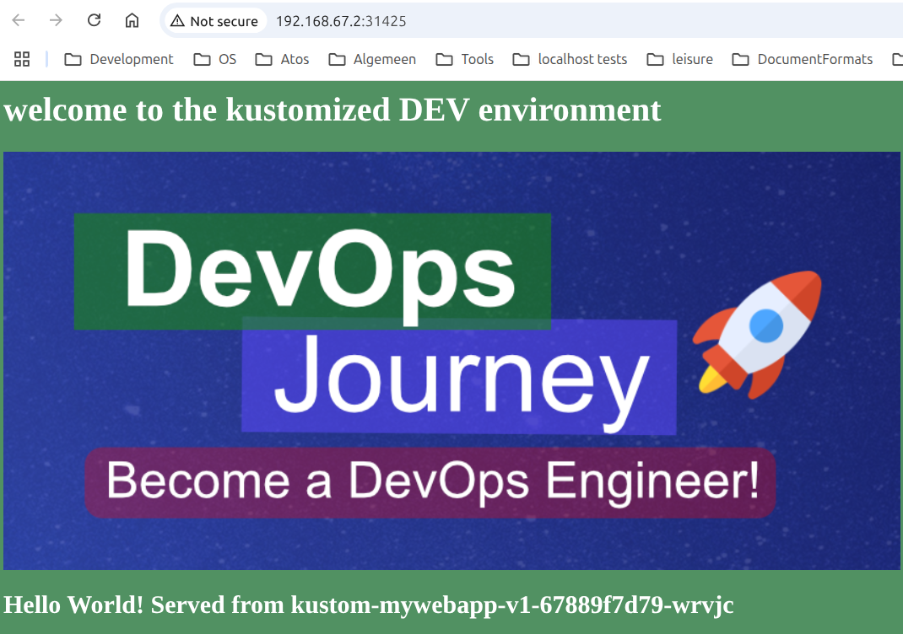

<style>
body {
  font-family: "Gentium Basic", Cardo , "Linux Libertine o", "Palatino Linotype", Cambria, serif;
  font-size: 100% !important;
  padding-right: 12%;
}
code {
  padding: 0.25em;
	
  white-space: pre;
  font-family: "Tlwg mono", Consolas, "Liberation Mono", Menlo, Courier, monospace;
	
  background-color: #ECFFFA;
  //border: 1px solid #ccc;
  //border-radius: 3px;
}

kbd {
  display: inline-block;
  padding: 3px 5px;
  font-family: "Tlwg mono", Consolas, "Liberation Mono", Menlo, Courier, monospace;
  line-height: 10px;
  color: #555;
  vertical-align: middle;
  background-color: #ECFFFA;
  border: solid 1px #ccc;
  border-bottom-color: #bbb;
  border-radius: 3px;
  box-shadow: inset 0 -1px 0 #bbb;
}

h1,h2,h3,h4,h5 {
  color: #269B7D; 
  font-family: "fira sans", "Latin Modern Sans", Calibri, "Trebuchet MS", sans-serif;
}

</style>

# Kustomize for multiple environments 
## with (`base/` and) `overlays/`
- [https://www.youtube.com/watch?v=spCdNeNCuFU&t=969s](https://www.youtube.com/watch?v=spCdNeNCuFU&t=969s)

## Steps
1. create `work-02`
2. create `work-02/base/` & `work-02/overlays/`
3. `work-02/overlays/dev/` & `work-02/overlays/prod/`
4. copy the files from `work/` into `work-02/base/`
5. create `kustomization.yaml` files in `work-02/overlays/dev/` & `work-02/overlays/prod/`

## Test dev environment
- `~/git/mykustomapp$ kubectl kustomize work-02/overlays/dev > work-02/overlays/dev/gen.yaml`
- This gave an error and some deprecation warnings.
- I got the error fixed first by substituting `patchesStrategicMerge` for `patches`, but this is depracated.
- Then by adding `path:` for list items under `patches` instead
- [https://github.com/kubernetes-sigs/kustomize/issues/1373](https://github.com/kubernetes-sigs/kustomize/issues/1373)

<details>

```bash
willem@mint-22:~/git/mykustomapp$ kubectl kustomize work-02/overlays/dev > work-02/overlays/dev/gen.yaml
error: invalid Kustomization: json: cannot unmarshal string into Go struct field Kustomization.patches of type types.Patch
willem@mint-22:~/git/mykustomapp$ kubectl kustomize work-02/overlays/dev > work-02/overlays/dev/gen.yaml
# Warning: 'bases' is deprecated. Please use 'resources' instead. Run 'kustomize edit fix' to update your Kustomization automatically.
# Warning: 'patchesStrategicMerge' is deprecated. Please use 'patches' instead. Run 'kustomize edit fix' to update your Kustomization automatically.
# Warning: 'commonLabels' is deprecated. Please use 'labels' instead. Run 'kustomize edit fix' to update your Kustomization automatically.
willem@mint-22:~/git/mykustomapp$ kubectl kustomize work-02/overlays/dev > work-02/overlays/dev/gen.yaml
# Warning: 'bases' is deprecated. Please use 'resources' instead. Run 'kustomize edit fix' to update your Kustomization automatically.
# Warning: 'commonLabels' is deprecated. Please use 'labels' instead. Run 'kustomize edit fix' to update your Kustomization automatically.
willem@mint-22:~/git/mykustomapp$ 
```

</details>

### create the `dev` and `prod` namespaces in our running `-p kustomize`
- `kubectl create namespace dev`
- `kubectl create namespace prod`
- check with `kubectl get namespaces`
- on the webconsole dashboard you can check under `Cluster > Namespaces`
- And for the view on artefacts you can select in the dropdown box among
  - All namespaces
  - default
  - dev
  - prod

### apply the overlays for the `dev` namespace
- `~/git/mykustomapp$ kubectl apply -k work-02/overlays/dev`
- check all artefacts in the `dev` namespace with
  - `kubectl get all -n dev`
- check all artefacts with label `app=mywebapp` on all namespaces (currently default & dev) with
  - `kubectl get all -l app=mywebapp --all-namespaces`
- open the homepage in a browser with
  - `minikube service kustom-mywebapp-v1 -n dev -p kustomize`

<details>

```bash
willem@mint-22:~/git/mykustomapp$ kubectl get namespaces
NAME                   STATUS   AGE
default                Active   31h
kube-node-lease        Active   31h
kube-public            Active   31h
kube-system            Active   31h
kubernetes-dashboard   Active   30h
willem@mint-22:~/git/mykustomapp$ kubectl create namespace dev
namespace/dev created
willem@mint-22:~/git/mykustomapp$ kubectl create namespace prod
namespace/prod created
willem@mint-22:~/git/mykustomapp$ kubectl get namespaces
NAME                   STATUS   AGE
default                Active   31h
dev                    Active   20s
kube-node-lease        Active   31h
kube-public            Active   31h
kube-system            Active   31h
kubernetes-dashboard   Active   30h
prod                   Active   7s
willem@mint-22:~/git/mykustomapp$ kubectl apply -k work-02/overlays/dev 
# Warning: 'bases' is deprecated. Please use 'resources' instead. Run 'kustomize edit fix' to update your Kustomization automatically.
# Warning: 'commonLabels' is deprecated. Please use 'labels' instead. Run 'kustomize edit fix' to update your Kustomization automatically.
configmap/mykustom-map-9486f9m9dh created
service/kustom-mywebapp-v1 created
deployment.apps/kustom-mywebapp-v1 created
willem@mint-22:~/git/mykustomapp$ kubectl get all -n dev
NAME                                      READY   STATUS    RESTARTS   AGE
pod/kustom-mywebapp-v1-67889f7d79-wrvjc   1/1     Running   0          106s
pod/kustom-mywebapp-v1-67889f7d79-wsms6   1/1     Running   0          106s

NAME                         TYPE           CLUSTER-IP      EXTERNAL-IP   PORT(S)        AGE
service/kustom-mywebapp-v1   LoadBalancer   10.105.206.96   <pending>     80:31425/TCP   106s

NAME                                 READY   UP-TO-DATE   AVAILABLE   AGE
deployment.apps/kustom-mywebapp-v1   2/2     2            2           106s

NAME                                            DESIRED   CURRENT   READY   AGE
replicaset.apps/kustom-mywebapp-v1-67889f7d79   2         2         2       106s
willem@mint-22:~/git/mykustomapp$ kubectl get all -l app=mywebapp --all-namespaces
NAMESPACE   NAME                                      READY   STATUS    RESTARTS   AGE
default     pod/kustom-mywebapp-v1-f875df8b-d8h2c     1/1     Running   0          10h
dev         pod/kustom-mywebapp-v1-67889f7d79-wrvjc   1/1     Running   0          27m
dev         pod/kustom-mywebapp-v1-67889f7d79-wsms6   1/1     Running   0          27m

NAMESPACE   NAME                         TYPE           CLUSTER-IP      EXTERNAL-IP   PORT(S)        AGE
default     service/kustom-mywebapp-v1   LoadBalancer   10.98.186.162   <pending>     80:31683/TCP   10h
dev         service/kustom-mywebapp-v1   LoadBalancer   10.105.206.96   <pending>     80:31425/TCP   27m

NAMESPACE   NAME                                 READY   UP-TO-DATE   AVAILABLE   AGE
default     deployment.apps/kustom-mywebapp-v1   1/1     1            1           10h
dev         deployment.apps/kustom-mywebapp-v1   2/2     2            2           27m
willem@mint-22:~/git/mykustomapp$ minikube service kustom-mywebapp-v1 -n dev
🤷  Profile "minikube" not found. Run "minikube profile list" to view all profiles.
👉  To start a cluster, run: "minikube start"
willem@mint-22:~/git/mykustomapp$ minikube service kustom-mywebapp-v1 -n dev -p kustomize
|-----------|--------------------|-------------|---------------------------|
| NAMESPACE |        NAME        | TARGET PORT |            URL            |
|-----------|--------------------|-------------|---------------------------|
| dev       | kustom-mywebapp-v1 | flask/80    | http://192.168.67.2:31425 |
|-----------|--------------------|-------------|---------------------------|
🎉  Opening service dev/kustom-mywebapp-v1 in default browser...
willem@mint-22:~/git/mykustomapp$ Gtk-Message: 21:57:05.395: Failed to load module "xapp-gtk3-module"
[0605/215705.460685:WARNING:chrome/app/chrome_main_linux.cc:82] Read channel stable from /app/extra/CHROME_VERSION_EXTRA
[0605/215705.555327:WARNING:chrome/app/chrome_main_linux.cc:82] Read channel stable from /app/extra/CHROME_VERSION_EXTRA
Opening in existing browser session.

```


</details>

## Remainder for `prod` environment
- [https://www.youtube.com/watch?v=spCdNeNCuFU&t=1388s](https://www.youtube.com/watch?v=spCdNeNCuFU&t=1388s)

### Changes with respect to `work-02/overlays/dev`
- copy content from [`work-02/overlays/dev`](../work-02/overlays/dev) into 
  [`work-02/overlays/prod`](../work-02/overlays/prod)
- in [`work-02/overlays/prod/kustomization.yaml`](../work-02/overlays/prod/kustomization.yaml) change
  - `namespace: dev` to `namespace: prod`
- in [`work-02/overlays/prod/config.properties`](../work-02/overlays/prod/config.properties) change
  - `CUSTOM_HEADER` to refer to `prod` environment instead of `dev`
  - `BG_COLOR=#519162` to `BG_COLOR=#519162` to emphasize the difference between `dev` and `prod`
- in [](../work-02/overlays/prod/replicas.yaml) change
  - `spec.replicas` to 3

### test the `prod` namespace
- `~/git/mykustomapp$ kubectl kustomize work-02/overlays/prod > work-02/overlays/prod/gen.yaml`
- Now you can compare 
  - [work-02/overlays/prod/gen.yaml](../work-02/overlays/prod/gen.yaml) with 
  - [work-02/overlays/dev/gen.yaml](../work-02/overlays/dev/gen.yaml)
- Apply the kustomization to the prod namespace of our minikube cluster with
  - `~/git/mykustomapp$ kubectl apply -k work-02/overlays/prod`
- check all artefacts in the `prod` namespace with
  - `kubectl get all -n prod`
- check all artefacts with label `app=mywebapp` on all namespaces (currently default & dev) with
  - `kubectl get all -l app=mywebapp --all-namespaces`
- open the homepage in a browser with
  - `minikube service kustom-mywebapp-v1 -n prod -p kustomize`

<details>

```bash
(base) willem@mint-22:~/git/mykustomapp$ minikube start -p kustomize
😄  [kustomize] minikube v1.35.0 on Linuxmint 22
🎉  minikube 1.36.0 is available! Download it: https://github.com/kubernetes/minikube/releases/tag/v1.36.0
💡  To disable this notice, run: 'minikube config set WantUpdateNotification false'

✨  Using the docker driver based on existing profile
👍  Starting "kustomize" primary control-plane node in "kustomize" cluster
🚜  Pulling base image v0.0.46 ...
🔄  Restarting existing docker container for "kustomize" ...
🐳  Preparing Kubernetes v1.32.0 on Docker 27.4.1 ...
🔎  Verifying Kubernetes components...
    ▪ Using image gcr.io/k8s-minikube/storage-provisioner:v5
    ▪ Using image docker.io/kubernetesui/dashboard:v2.7.0
    ▪ Using image docker.io/kubernetesui/metrics-scraper:v1.0.8
💡  Some dashboard features require the metrics-server addon. To enable all features please run:

        minikube -p kustomize addons enable metrics-server

🌟  Enabled addons: default-storageclass, storage-provisioner, dashboard
🏄  Done! kubectl is now configured to use "kustomize" cluster and "default" namespace by default
(base) willem@mint-22:~/git/mykustomapp$ kubectl get all -l app=mywebapp --all-namespaces
NAMESPACE   NAME                                      READY   STATUS    RESTARTS      AGE
default     pod/kustom-mywebapp-v1-f875df8b-d8h2c     1/1     Running   1 (13h ago)   23h
dev         pod/kustom-mywebapp-v1-67889f7d79-wrvjc   1/1     Running   1 (13h ago)   14h
dev         pod/kustom-mywebapp-v1-67889f7d79-wsms6   1/1     Running   1 (13h ago)   14h

NAMESPACE   NAME                         TYPE           CLUSTER-IP      EXTERNAL-IP   PORT(S)        AGE
default     service/kustom-mywebapp-v1   LoadBalancer   10.98.186.162   <pending>     80:31683/TCP   24h
dev         service/kustom-mywebapp-v1   LoadBalancer   10.105.206.96   <pending>     80:31425/TCP   14h

NAMESPACE   NAME                                 READY   UP-TO-DATE   AVAILABLE   AGE
default     deployment.apps/kustom-mywebapp-v1   1/1     1            1           24h
dev         deployment.apps/kustom-mywebapp-v1   2/2     2            2           14h

NAMESPACE   NAME                                            DESIRED   CURRENT   READY   AGE
default     replicaset.apps/kustom-mywebapp-v1-59565b8f7c   0         0         0       24h
default     replicaset.apps/kustom-mywebapp-v1-f875df8b     1         1         1       23h
dev         replicaset.apps/kustom-mywebapp-v1-67889f7d79   2         2         2       14h
(base) willem@mint-22:~/git/mykustomapp$ kubectl kustomize work-02/overlays/prod > work-02/overlays/prod/gen.yaml
# Warning: 'bases' is deprecated. Please use 'resources' instead. Run 'kustomize edit fix' to update your Kustomization automatically.
# Warning: 'commonLabels' is deprecated. Please use 'labels' instead. Run 'kustomize edit fix' to update your Kustomization automatically.
(base) willem@mint-22:~/git/mykustomapp$ kubectl kustomize work-02/overlays/prod > work-02/overlays/prod/gen.yaml
# Warning: 'bases' is deprecated. Please use 'resources' instead. Run 'kustomize edit fix' to update your Kustomization automatically.
# Warning: 'commonLabels' is deprecated. Please use 'labels' instead. Run 'kustomize edit fix' to update your Kustomization automatically.
(base) willem@mint-22:~/git/mykustomapp$ kubectl apply -k work-02/overlays/prod
# Warning: 'bases' is deprecated. Please use 'resources' instead. Run 'kustomize edit fix' to update your Kustomization automatically.
# Warning: 'commonLabels' is deprecated. Please use 'labels' instead. Run 'kustomize edit fix' to update your Kustomization automatically.
configmap/mykustom-map-kcc8f98gcc created
service/kustom-mywebapp-v1 created
deployment.apps/kustom-mywebapp-v1 created
(base) willem@mint-22:~/git/mykustomapp$ kubectl get all -n prod
NAME                                      READY   STATUS    RESTARTS   AGE
pod/kustom-mywebapp-v1-5df468f984-4cc97   1/1     Running   0          24s
pod/kustom-mywebapp-v1-5df468f984-4tb6p   1/1     Running   0          24s
pod/kustom-mywebapp-v1-5df468f984-mtq7q   1/1     Running   0          24s

NAME                         TYPE           CLUSTER-IP      EXTERNAL-IP   PORT(S)        AGE
service/kustom-mywebapp-v1   LoadBalancer   10.101.99.212   <pending>     80:32523/TCP   24s

NAME                                 READY   UP-TO-DATE   AVAILABLE   AGE
deployment.apps/kustom-mywebapp-v1   3/3     3            3           24s

NAME                                            DESIRED   CURRENT   READY   AGE
replicaset.apps/kustom-mywebapp-v1-5df468f984   3         3         3       24s
(base) willem@mint-22:~/git/mykustomapp$ kubectl get all -l app=mywebapp --all-namespaces
NAMESPACE   NAME                                      READY   STATUS    RESTARTS      AGE
default     pod/kustom-mywebapp-v1-f875df8b-d8h2c     1/1     Running   1 (13h ago)   24h
dev         pod/kustom-mywebapp-v1-67889f7d79-wrvjc   1/1     Running   1 (13h ago)   14h
dev         pod/kustom-mywebapp-v1-67889f7d79-wsms6   1/1     Running   1 (13h ago)   14h
prod        pod/kustom-mywebapp-v1-5df468f984-4cc97   1/1     Running   0             67s
prod        pod/kustom-mywebapp-v1-5df468f984-4tb6p   1/1     Running   0             67s
prod        pod/kustom-mywebapp-v1-5df468f984-mtq7q   1/1     Running   0             67s

NAMESPACE   NAME                         TYPE           CLUSTER-IP      EXTERNAL-IP   PORT(S)        AGE
default     service/kustom-mywebapp-v1   LoadBalancer   10.98.186.162   <pending>     80:31683/TCP   24h
dev         service/kustom-mywebapp-v1   LoadBalancer   10.105.206.96   <pending>     80:31425/TCP   14h
prod        service/kustom-mywebapp-v1   LoadBalancer   10.101.99.212   <pending>     80:32523/TCP   67s

NAMESPACE   NAME                                 READY   UP-TO-DATE   AVAILABLE   AGE
default     deployment.apps/kustom-mywebapp-v1   1/1     1            1           24h
dev         deployment.apps/kustom-mywebapp-v1   2/2     2            2           14h
prod        deployment.apps/kustom-mywebapp-v1   3/3     3            3           67s

NAMESPACE   NAME                                            DESIRED   CURRENT   READY   AGE
default     replicaset.apps/kustom-mywebapp-v1-59565b8f7c   0         0         0       24h
default     replicaset.apps/kustom-mywebapp-v1-f875df8b     1         1         1       24h
dev         replicaset.apps/kustom-mywebapp-v1-67889f7d79   2         2         2       14h
prod        replicaset.apps/kustom-mywebapp-v1-5df468f984   3         3         3       67s
(base) willem@mint-22:~/git/mykustomapp$ minikube service kustom-mywebapp-v1 -n prod -p kustomize
|-----------|--------------------|-------------|---------------------------|
| NAMESPACE |        NAME        | TARGET PORT |            URL            |
|-----------|--------------------|-------------|---------------------------|
| prod      | kustom-mywebapp-v1 | flask/80    | http://192.168.67.2:32523 |
|-----------|--------------------|-------------|---------------------------|
🎉  Opening service prod/kustom-mywebapp-v1 in default browser...
(base) willem@mint-22:~/git/mykustomapp$ Gtk-Message: 12:18:09.058: Failed to load module "xapp-gtk3-module"
[0606/121809.120070:WARNING:chrome/app/chrome_main_linux.cc:82] Read channel stable from /app/extra/CHROME_VERSION_EXTRA
[0606/121809.219835:WARNING:chrome/app/chrome_main_linux.cc:82] Read channel stable from /app/extra/CHROME_VERSION_EXTRA
Opening in existing browser session.
^C
(base) willem@mint-22:~/git/mykustomapp$ minikube stop -p kustomize
✋  Stopping node "kustomize"  ...
🛑  Powering off "kustomize" via SSH ...
🛑  1 node stopped.
(base) willem@mint-22:~/git/mykustomapp$ 
```

</details>

## Stopping minikube
- stopping minikube dashboard with Ctrl+C
- `minikube stop -p kustomize`
