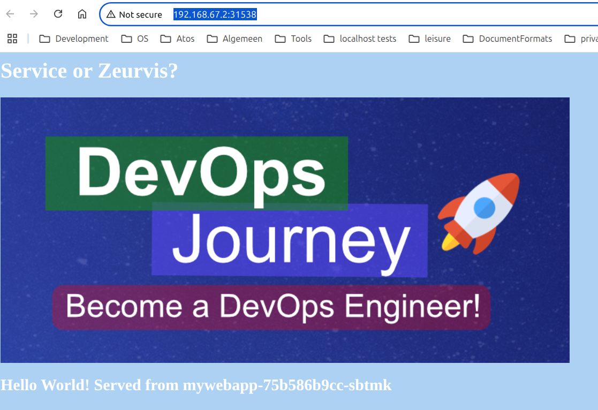

<style>
body {
  font-family: "Gentium Basic", Cardo , "Linux Libertine o", "Palatino Linotype", Cambria, serif;
  font-size: 100% !important;
  padding-right: 12%;
}
code {
  padding: 0.25em;
	
  white-space: pre;
  font-family: "Tlwg mono", Consolas, "Liberation Mono", Menlo, Courier, monospace;
	
  background-color: #ECFFFA;
  //border: 1px solid #ccc;
  //border-radius: 3px;
}

kbd {
  display: inline-block;
  padding: 3px 5px;
  font-family: "Tlwg mono", Consolas, "Liberation Mono", Menlo, Courier, monospace;
  line-height: 10px;
  color: #555;
  vertical-align: middle;
  background-color: #ECFFFA;
  border: solid 1px #ccc;
  border-bottom-color: #bbb;
  border-radius: 3px;
  box-shadow: inset 0 -1px 0 #bbb;
}

h1,h2,h3,h4,h5 {
  color: #269B7D; 
  font-family: "fira sans", "Latin Modern Sans", Calibri, "Trebuchet MS", sans-serif;
}

</style>

# Minikube with new profile setup
## Context
- we want to use this minikube cluster with `-p kustomize` to try out k8s kustomization
- [https://www.youtube.com/watch?v=spCdNeNCuFU](https://www.youtube.com/watch?v=spCdNeNCuFU)

## Minikube Overview
- [https://github.com/wjc-van-es/cnsia/blob/main/doc/k8s-minikube.md](https://github.com/wjc-van-es/cnsia/blob/main/doc/k8s-minikube.md)

## Checking versions with `minikube update-check`

<details>

```bash
willem@mint-22:~/git/mykustomapp$ kubectl version
Client Version: v1.32.1
Kustomize Version: v5.5.0
The connection to the server localhost:8080 was refused - did you specify the right host or port?
willem@mint-22:~/git/mykustomapp$ minikube version
minikube version: v1.35.0
commit: dd5d320e41b5451cdf3c01891bc4e13d189586ed-dirty
willem@mint-22:~/git/mykustomapp$ minikube update-check
CurrentVersion: v1.35.0
LatestVersion: v1.36.0
willem@mint-22:~/git/mykustomapp$ docker version
Client: Docker Engine - Community
 Version:           28.2.2
 API version:       1.50
 Go version:        go1.24.3
 Git commit:        e6534b4
 Built:             Fri May 30 12:07:27 2025
 OS/Arch:           linux/amd64
 Context:           default

Server: Docker Engine - Community
 Engine:
  Version:          28.2.2
  API version:      1.50 (minimum version 1.24)
  Go version:       go1.24.3
  Git commit:       45873be
  Built:            Fri May 30 12:07:27 2025
  OS/Arch:          linux/amd64
  Experimental:     false
 containerd:
  Version:          1.7.27
  GitCommit:        05044ec0a9a75232cad458027ca83437aae3f4da
 runc:
  Version:          1.2.5
  GitCommit:        v1.2.5-0-g59923ef
 docker-init:
  Version:          0.19.0
  GitCommit:        de40ad0
willem@mint-22:~/git/mykustomapp$ 
```

</details>

- As a minikube update entails a completely fresh installation (including an uninstallation & reconfiguration), we 
  haven't done so as the version is not too old.
- If we do need to do an update see
  - [https://github.com/wjc-van-es/cnsia/blob/main/doc/minikube_updates.md](https://github.com/wjc-van-es/cnsia/blob/main/doc/minikube_updates.md)
  - [https://github.com/kiranmsalunke/minikube_upgrade](https://github.com/kiranmsalunke/minikube_upgrade)
- For a completely fresh installation:
    [https://github.com/wjc-van-es/quia/blob/main/docs/%C2%A711.3-kubectl_%26_minikube-install.md](https://github.com/wjc-van-es/quia/blob/main/docs/%C2%A711.3-kubectl_%26_minikube-install.md)

## First setup of `kustomize` profile
- creation & first start: `minikube start --cpus 2 --memory 4g --driver docker -p kustomize`
  - subsequent starts only need the profile name specified: `minikube start -p kustomize`
- when starting the dashboard (in a separate terminal) we need to include the profile name as well:
  `minikube dashboard -p kustomize`
  - stop the dashboard with Ctrl+C
- Stop minikube profile: `minikube stop -p kustomize`

## First test run without any kustomize
- what images are in the `-p kustomize` minikube cluster?
  - `minikube -p kustomize image ls`
- pull the latest image of the simple web app within the `-p kustomize` minikube cluster
  - for the right image see 
    [https://hub.docker.com/r/devopsjourney1/mywebapp/tags](https://hub.docker.com/r/devopsjourney1/mywebapp/tags)
  - `minikube image pull devopsjourney1/mywebapp:latest -p kustomize`
- apply the content of `~/git/mykustomapp/original` to the minikube cluster
```bash
willem@mint-22:~/git/mykustomapp$ kubectl apply -f original/
configmap/mywebapp-configmapv1.0 created
deployment.apps/mywebapp created
service/mywebapp created
```

- check running pods with command `kubectl get po -A`
- check artefacts with label `app=mywebapp` with command `kubectl get all -l app=mywebapp`

<details>

```bash
willem@mint-22:~/git/mykustomapp$ kubectl get po -A
NAMESPACE              NAME                                         READY   STATUS    RESTARTS      AGE
default                mywebapp-75b586b9cc-sbtmk                    1/1     Running   0             33s
kube-system            coredns-668d6bf9bc-pbtzx                     1/1     Running   0             32m
kube-system            etcd-kustomize                               1/1     Running   0             32m
kube-system            kube-apiserver-kustomize                     1/1     Running   0             32m
kube-system            kube-controller-manager-kustomize            1/1     Running   0             32m
kube-system            kube-proxy-mh6fk                             1/1     Running   0             32m
kube-system            kube-scheduler-kustomize                     1/1     Running   0             32m
kube-system            storage-provisioner                          1/1     Running   1 (31m ago)   32m
kubernetes-dashboard   dashboard-metrics-scraper-5d59dccf9b-7vgnq   1/1     Running   0             29m
kubernetes-dashboard   kubernetes-dashboard-7779f9b69b-zhgmr        1/1     Running   0             29m

willem@mint-22:~/git/mykustomapp$ kubectl get all -l app=mywebapp
NAME                            READY   STATUS    RESTARTS   AGE
pod/mywebapp-75b586b9cc-sbtmk   1/1     Running   0          6m14s

NAME               TYPE           CLUSTER-IP       EXTERNAL-IP   PORT(S)        AGE
service/mywebapp   LoadBalancer   10.108.168.237   <pending>     80:30478/TCP   6m14s

NAME                       READY   UP-TO-DATE   AVAILABLE   AGE
deployment.apps/mywebapp   1/1     1            1           6m14s

NAME                                  DESIRED   CURRENT   READY   AGE
replicaset.apps/mywebapp-75b586b9cc   1         1         1       6m14s

```

</details>

- get the name of the service with `kubectl get services`: `mywebapp`
- open the service in a browser with: `minikube service mywebapp -p kustomize`
- At first there is a problem:

<details>

```bash
willem@mint-22:~/git/mykustomapp$ kubectl get services
NAME         TYPE           CLUSTER-IP       EXTERNAL-IP   PORT(S)        AGE
kubernetes   ClusterIP      10.96.0.1        <none>        443/TCP        86m
mywebapp     LoadBalancer   10.108.168.237   <pending>     80:30478/TCP   54m
willem@mint-22:~/git/mykustomapp$ minikube service mywebapp -p kustomize
|-----------|----------|-------------|---------------------------|
| NAMESPACE |   NAME   | TARGET PORT |            URL            |
|-----------|----------|-------------|---------------------------|
| default   | mywebapp | flask/80    | http://192.168.67.2:30478 |
|-----------|----------|-------------|---------------------------|

❌  Exiting due to SVC_UNREACHABLE: service not available: no running pod for service mywebapp found

╭───────────────────────────────────────────────────────────────────────────────────────────╮
│                                                                                           │
│    😿  If the above advice does not help, please let us know:                             │
│    👉  https://github.com/kubernetes/minikube/issues/new/choose                           │
│                                                                                           │
│    Please run `minikube logs --file=logs.txt` and attach logs.txt to the GitHub issue.    │
│    Please also attach the following file to the GitHub issue:                             │
│    - /tmp/minikube_service_9d2f2f3297c64cbc3f9fd00f6e5604cbcf27475c_0.log                 │
│                                                                                           │
╰───────────────────────────────────────────────────────────────────────────────────────────╯

```

</details>

- I suspect the cause lies in the [../original/service.yaml](../original/service.yaml)
- in the order of `spec.selector` and `spec.ports` that some mixup in those prevent the intended reference to the 
  corresponding pod with the same label `app: mywebapp` in [../original/deployment.yaml](../original/deployment.yaml)
  - `metadata.labels.app`,
  - `spec.selector.matchLabels.app` and
  - `spec.template.metadata.labels.app`
- I deleted the service in the kubernetes-dashboard and applied the modified `service.yaml` with
  `~/git/mykustomapp$ kubectl apply -f original/service.yaml`
- the `mywebapp` service remains pending as shown with `kubectl get services` and from the minikube dashboard
- however `minikube -p kustomize service mywebapp` now opened a browser tab dispalying the home page

<details>

```bash
willem@mint-22:~/git/mykustomapp$ kubectl get services
NAME         TYPE           CLUSTER-IP      EXTERNAL-IP   PORT(S)        AGE
kubernetes   ClusterIP      10.96.0.1       <none>        443/TCP        7h5m
mywebapp     LoadBalancer   10.99.155.117   <pending>     80:31538/TCP   4h55m
willem@mint-22:~/git/mykustomapp$ minikube -p kustomize service mywebapp
|-----------|----------|-------------|---------------------------|
| NAMESPACE |   NAME   | TARGET PORT |            URL            |
|-----------|----------|-------------|---------------------------|
| default   | mywebapp |          80 | http://192.168.67.2:31538 |
|-----------|----------|-------------|---------------------------|
🎉  Opening service default/mywebapp in default browser...
willem@mint-22:~/git/mykustomapp$ Gtk-Message: 16:47:48.540: Failed to load module "xapp-gtk3-module"
[0604/164748.601757:WARNING:chrome/app/chrome_main_linux.cc:82] Read channel stable from /app/extra/CHROME_VERSION_EXTRA
[0604/164748.714370:WARNING:chrome/app/chrome_main_linux.cc:82] Read channel stable from /app/extra/CHROME_VERSION_EXTRA
Opening in existing browser session.
```



</details>

- removing the original configuration with `~/git/mykustomapp$ kubectl delete -f original/`
- Stop minikube profile: `minikube stop -p kustomize`

## Next part
- [kustomize_1rst-steps.md](kustomize_1rst-steps.md)
